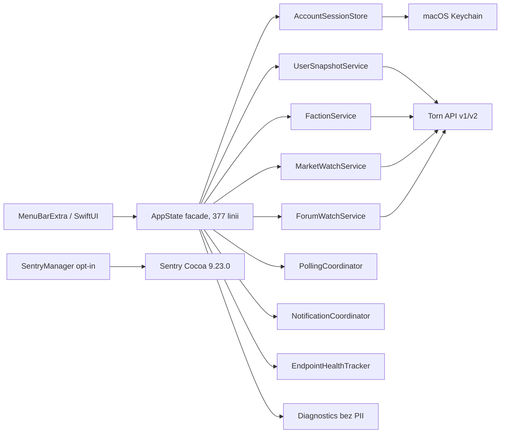

# MacTorn — raport audytu technicznego i bezpieczeństwa

Data audytu: 2026-07-30
Audytowana wersja bazowa: 1.10.0 (build 1), macOS 14+
Stan dokumentu: po wdrożeniach T01–T17 i zielonych lokalnych bramkach automatycznych

## Executive summary

MacTorn ma solidny fundament: natywny SwiftUI, minimalny sandbox, klucz Torn w Keychain, opt-in Sentry bez domyślnego PII oraz hermetyczne fixture'y. Audyt i kolejne fale prac usunęły potwierdzone problemy z izolacją konta, budżetem API, semantyką odpowiedzi, wiarygodnością freshness, odwracalnością akcji, nawigacją i dostępnością.

Stan potwierdzony:

- 0 otwartych P0/P1;
- Debug build: PASS;
- finalny `build-for-testing`: PASS;
- `make coverage-gate`: PASS;
- 428/428 testów jednostkowych: PASS, 0 failed, 0 skipped;
- 8/8 testów UI: PASS, 0 failed, 0 skipped;
- Sentry Cocoa resolved: 9.23.0;
- `AppState.swift`: 377 linii; pięć wydzielonych serwisów/store i sześć plików extension;
- Quick Travel ma aktualne czasy Standard i Airstrip + pilot, a aktywny lot pozostaje API-driven;
- docelowy Release pozostaje universal i podpisywany ad hoc zgodnie z decyzją T16-A.

Ocena gotowości: **lokalny automated release candidate jest zielony**. Otwarte pozostaje manualne QA systemowe T14/T15 oraz pierwszy rzeczywisty run nowego workflow CI. Developer ID i notarization nie są częścią przyjętego zakresu T16-A.

## Zakres i mapa projektu

Aktualny snapshot drzewa:

- 51 plików produkcyjnych Swift, 11 920 linii;
- 37 plików testowych Swift, 7 265 linii;
- 428 metod unit i 8 metod UI w źródłach;
- jedna zewnętrzna zależność SPM: Sentry Cocoa 9.23.0.

`AppState.swift` spełnia cel cienkiego facade poniżej 800 linii. Logika wspierająca jest rozłożona na sześć tematycznych extension files, a granice account/user/faction/market/forum są dodatkowo wydzielone do pięciu testowalnych serwisów/store.

## Naprawione problemy

| ID | Priorytet | Problem | Aktualny stan i dowód |
|---|---:|---|---|
| F-01 | P1 | Spóźniona odpowiedź starego klucza mogła opublikować dane poprzedniego konta. | Generation token, `AccountSessionStore`, anulowanie i kontrola przed publikacją. Test unit oraz syntetyczny UI A→B przechodzą. |
| F-02 | P1 | Część ścieżek mogła ominąć wspólny limit requestów. | Jedna bramka `reserveRequest`; testy wszystkich ścieżek i hard cap przechodzą. |
| F-03 | P2 | Niepoprawny payload mógł wyglądać jak udany refresh. | Semantyczny kontrakt odpowiedzi, freshness per endpoint i zachowanie ostatnich dobrych danych. |
| F-04 | P2 | Logi lub transportowy błąd mogły ujawniać URL/dane domenowe. | Typowane komunikaty, redakcja URL, ograniczone logi i Diagnostics bez PII. |
| F-05 | P2 | Uszkodzone preferencje i niepoprawne dane formularzy. | Allowlisty interwałów, walidacja klucza/forum/watchlisty i dodatniego progu ceny. |
| F-06 | P2 | Kolizje `TornEvent.id`. | Stabilny klucz API, z bezpiecznym fallbackiem. |
| F-07 | P2 | Brak pełnej semantyki AX i niespójny feedback błędów. | AX labels/values/selected traits, wspólny `ModuleStateView`, recovery CTA i semantyczne fonty. |
| F-08 | P2 | Usuwanie watchlisty i wątku było nieodwracalne. | Sześciosekundowe Undo przywraca pełny element i pierwotną pozycję. |
| F-09 | P2 | Siedem tabów i tekst 8 pt w powierzchni 320 pt. | Nawigacja `Now / Account / Watch`, aktywny drugi picker i skróty `⌘1…⌘7`. |
| F-10 | P3 | Watchlist/forum uruchamiały nieograniczony fan-out. | `BoundedTaskQueue` z limitem 4 i obsługą anulowania. |
| F-11 | P3 | Monolityczny `AppState.swift` zwiększał ryzyko regresji. | 377-liniowy facade, 5 serwisów/store, 6 extension files i 31 izolowanych testów serwisów. |
| F-12 | P3 | Sentry Cocoa pozostawał na 9.12.0. | Resolved 9.23.0; testy opt-in/off, crash-only i PII scrubbera przechodzą w pełnym unit suite. |
| F-13 | P2 | Quick Travel używał nieaktualnej tabeli i nie rozróżniał metod. | Oficjalne czasy po Patch #438, jawny Standard/Airstrip + pilot, ±3%; aktywny lot używa pól API. |
| F-14 | P2 | Status i Settings tworzyły zbyt długie, powtarzalne powierzchnie przewijania. | Status ma wysokość 480 pt i pojedynczy pasek najbliższej akcji; Settings pokazuje jedną z sześciu stale dostępnych sekcji. |
| F-14 | P2 | Prefilled SecureField w Settings tracił placeholder na macOS 26 i eksponował pustą etykietę AX. | Dodano jawne `.accessibilityLabel("Torn API Key")`; finalny all-modules+Settings AX test przechodzi. |

## Pozostałe ryzyka i blokery

| ID | Priorytet | Stan | Następna akcja |
|---|---:|---|---|
| R-01 | P2 | Manualny VoiceOver audio, real Full Keyboard Access oraz systemowe Reduce Motion/Increase Contrast nie zostały wykonane. | Przejść macierz 7 modułów + Settings na dedykowanym profilu macOS. |
| R-02 | P2 | Test z dwoma prawdziwymi kontami nie został wykonany; automatyczny fixture A→B jest zielony. | Użytkownik dostarcza dwa testowe klucze przez UI i zatwierdza scenariusz. |
| R-03 | P2 | Powiadomienia systemowe i Launch at Login wymagają zgody oraz trwałej zmiany stanu systemu. | Wykonać na osobnym profilu macOS po jawnej akceptacji. |
| R-04 | P3 | Sześć extension files ma łącznie 1 640 linii; część orkiestracji nadal należy do facade. | Dalszy podział tylko przy konkretnych metrykach regresji/utrzymania, bez rewrite'u. |
| R-05 | P3 | Nowy workflow CI jest skonfigurowany, ale nie był jeszcze wykonany zdalnie z tego nieopublikowanego worktree. | Po pushu zachować pierwszy zielony zestaw artefaktów CI. |

## Bezpieczeństwo i prywatność

- Klucz Torn pozostaje w macOS Keychain; dawna wartość `UserDefaults` jest migrowana/usuwana.
- Logi requestów są redagowane, a Diagnostics nie pokazuje klucza, nazwy ani ID gracza.
- Sentry 9.23.0 jest off-by-default, nie startuje w UI tests, ma `sendDefaultPii = false`, wyłączone śledzenie requestów i scrubbery zdarzeń/breadcrumbs.
- Jedna atomowa bramka budżetu działa przed każdą ścieżką sieciową.
- Release używa minimalnych entitlementów: app sandbox i network client.
- T16-A świadomie pozostawia lokalny artefakt przy strict ad-hoc signing; Developer ID, notarization, stapling i publikacja są poza zakresem.
- Finalny `make scan` przeszedł bez wykrytych wycieków.

## Wydajność i niezawodność

- Parsowanie snapshotu odbywa się poza MainActor; publikacja wraca na MainActor.
- Cięższe endpointy mają osobne minimalne interwały i per-endpoint backoff.
- Watchlist i forum korzystają z bounded concurrency = 4.
- Daily-row-limit pauzuje wyłącznie dotknięte źródło.
- Freshness nie zastępuje ostatnich poprawnych danych przejściowym błędem.
- Brak świeżych pomiarów Instruments; nie rekomenduje się mikrooptymalizacji bez metryk.

## Zależności

Jedyna zależność zewnętrzna:

- wymaganie SPM: `upToNextMajor` od 9.0.0;
- resolved: **Sentry Cocoa 9.23.0**;
- revision: `afa7510e05b99f35c1febe47566bfd868fa53fb9`;
- opt-in/off i PII contract są przypięte testami.

## Wyniki walidacji

### Baseline audytu

| Kontrola | Wynik |
|---|---|
| `make test` | PASS, 354/354. |
| `make coverage-gate` | PASS, wszystkie krytyczne moduły ≥80%. |
| Debug / analyze / universal ad-hoc Release | PASS dla bazowego zakresu audytu. |
| UI runner | Pierwotnie BLOCKED przez lokalny bootstrap/automation timeout. |

### Aktualny stan po T01–T17

| Kontrola | Wynik |
|---|---|
| Final Debug build | PASS. |
| Final `build-for-testing` | PASS. |
| `make coverage-gate` | **PASS; 428/428, 0 failed, 0 skipped.** |
| Result bundle | `/Users/pawelorzech/Programowanie/MacTorn/TestResults.xcresult` |
| `TornAPIError` | 99,07%. |
| `TornEndpoint` | 83,56%. |
| `PollingCoordinator` | 100%. |
| `NotificationCoordinator` | 100%. |
| `NextAction` | 96,51%. |
| 320 pt accessibility-display navigation smoke | PASS. |
| Syntetyczny UI account A→B | PASS. |
| Finalny all-modules + Settings AX | PASS, 48.535 s. |
| Finalny stale account-switch UI | PASS, 15.534 s. |
| Pełny final UI suite | **PASS; 8/8, 0 failed, 0 skipped, 0 expected failures.** Bundle: `/tmp/mactorn-final-ui-suite-20260730-1058-clean.xcresult`. |
| Final post-merge `make analyze` | PASS, ponowiony po poprawce AX produkcyjnego SecureField. |
| Final `make scan` | PASS, brak wycieków. |
| `make release` | PASS po usunięciu wyłącznie przestarzałego Sentry PCM z `DerivedData/Release`; początkowy błąd cache nie był błędem kodu. |
| `make verify-release` | PASS; artefakt `DerivedData/Release/Build/Products/Release/MacTorn.app`. |
| Final universal strict ad-hoc Release | PASS; `x86_64 arm64`, `Signature=adhoc`, brak TeamIdentifier, strict/deep codesign i DR valid. |

## Manualny QA przed lokalnym wydaniem

- [x] Hermetyczny full fixture, invalid key i offline.
- [x] Grouped navigation oraz selected state w AX.
- [x] Walidacja progu ceny i forum zachowuje błędny input.
- [x] Undo watchlisty i forum ma testy regresyjne.
- [x] Synthetic account A→B nie pokazuje spóźnionej tożsamości A.
- [ ] VoiceOver audio: wszystkie moduły i Settings.
- [ ] Rzeczywisty Full Keyboard Access.
- [ ] Systemowe Reduce Motion, Increase Contrast i Reduce Transparency.
- [ ] Dwa rzeczywiste konta testowe A→B.
- [ ] Permission, treść i kliknięcie powiadomienia.
- [ ] Launch at Login po wylogowaniu/zalogowaniu.
- [x] Finalny pełny UI suite 8/8.
- [x] Finalny post-merge analyze i scan.
- [x] Universal strict ad-hoc Release.

Developer ID, notarization i Gatekeeper distribution smoke nie są blockerem przyjętego lokalnego T16-A. Wymagałyby nowej decyzji i osobnej zgody.
