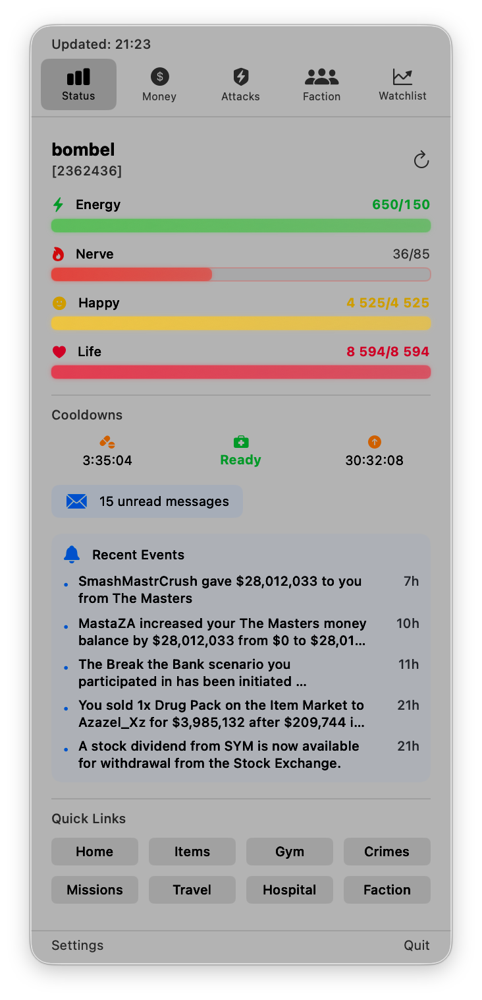

# MacTorn

A native macOS menu bar app for monitoring your **Torn** game status.




## Features

### 📊 Status Tab
- Live Energy, Nerve, Happy, Life bars with color-coded progress
- Cooldown timers (Drug, Medical, Booster)
- Travel monitoring with arrival countdown
- Chain timer with timeout warning
- Hospital/Jail status badges
- Unread messages badge
- Events feed
- 8 customizable quick links

### 💰 Money Tab
- Cash, Vault, Points, Tokens display
- Quick actions: Send Money, Bazaar, Bank

### ⚔️ Attacks Tab
- Battle stats (Strength, Defense, Speed, Dexterity)
- Recent attacks with W/L results
- Quick actions: Attack, Hospital, Bounties

### 🏢 Faction Tab
- Faction info and chain status
- War status display
- Armory quick-use buttons

### 📈 Watchlist Tab
- Track item prices
- Price change indicators
- Add/remove items from watchlist

### 🏠 Properties Tab
- Property info and vault contents
- Upkeep status and countdown

### ⚙️ General
- 🔔 Smart notifications for bars, cooldowns, landing, chain
- 🕒 Configurable refresh intervals (15s/30s/60s/2m)
- 🚀 Launch at Login

## Installation

1. Download the latest release from [Releases](https://github.com/pawelorzech/MacTorn/releases)
2. Unzip and drag `MacTorn.app` to your Applications folder
3. Open MacTorn from Applications
4. Enter your [Torn API Key](https://www.torn.com/preferences.php#tab=api)

> **Note**: If you download an unsigned build, macOS Gatekeeper will block it. Right-click the app and select "Open", or go to System Settings → Privacy & Security → Open Anyway.

## Requirements

- macOS 13.0 (Ventura) or later
- Torn API Key with access to: basic, bars, cooldowns, travel, profile, events, messages

## Configuration

### Refresh Interval
Choose polling frequency: 15s, 30s, 60s, or 120s

### Notifications
MacTorn sends notifications for bar thresholds, cooldown ready, landing, chain expiring, and release. Notification defaults are stored locally.

### Quick Links
8 preset shortcuts to common Torn pages (fully editable)

## Building from Source

```bash
git clone https://github.com/pawelorzech/MacTorn.git
cd MacTorn/MacTorn
open MacTorn.xcodeproj
```

Press `Cmd + R` to build and run.

## Support the Developer

If you find MacTorn useful, send some Xanax or cash to **bombel** [[2362436](https://www.torn.com/profiles.php?XID=2362436)]!

## License

MIT License - see [LICENSE](LICENSE) for details.

---

Made with ⚡ for the Torn community
