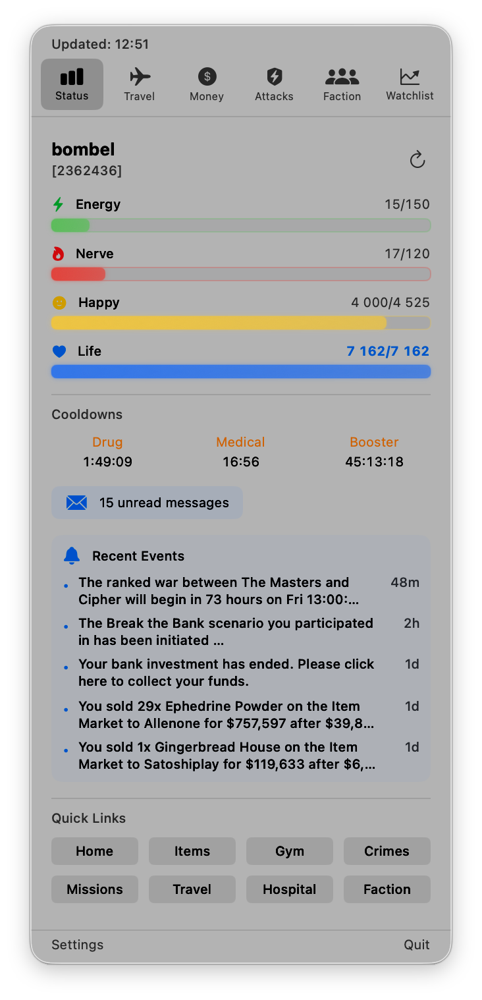
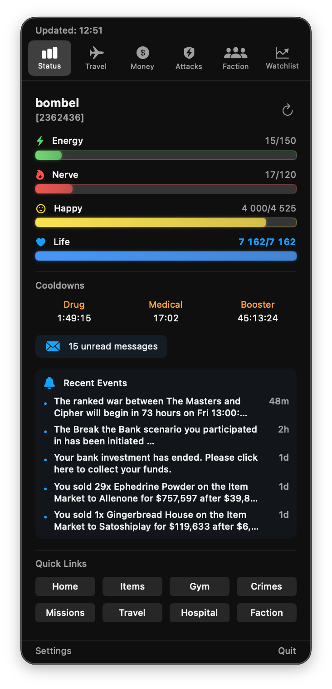

# MacTorn

A native macOS menu bar app for monitoring your **Torn** game status.


<p align="center">
  
  &nbsp;&nbsp;
  
</p>

## Features

### 📊 Status Tab
- Live Energy, Nerve, Happy, Life bars with color-coded progress
- Cooldown timers (Drug, Medical, Booster)
- Travel monitoring with arrival countdown
- Chain timer with timeout warning
- Hospital/Jail status badges
- Unread messages badge
- Events feed
- 8 customizable quick links

### ✈️ Travel Tab
- **Live countdown timer** in menu bar during flight (✈️🇺🇸 5:32)
- Flight status with progress bar
- Quick travel destination picker (all 11 Torn destinations)
- Pre-arrival notifications (configurable: 2min, 1min, 30sec, 10sec)
- Country flags for all destinations

### 💰 Money Tab
- Cash, Vault, Points, Tokens display
- Quick actions: Send Money, Bazaar, Bank

### ⚔️ Attacks Tab
- Battle stats (Strength, Defense, Speed, Dexterity)
- Recent attacks with W/L results
- Quick actions: Attack, Hospital, Bounties

### 🏢 Faction Tab
- Faction info and chain status
- War status display
- Armory quick-use buttons

### 📈 Watchlist Tab
- Track item prices (Latest API v2 support)
- Displays lowest market price AND quantity (e.g., `$4.2M x12`)
- Price change indicators
- Add/remove items from watchlist

### ⚙️ General
- **🔄 Update Checker**: Automatically notifies you when a new version is available on GitHub.
- **🔔 Smart Notifications**: Alerts for bar thresholds, cooldown ready, landing, chain expiring.
- **🕒 Configurable Refresh**: Intervals (15s/30s/60s/2m).
- **🚀 Launch at Login**: Start seamlessly with macOS.
- **⚡️ Optimized Startup**: Non-blocking data fetching for instant UI responsiveness.

## Accessibility

MacTorn respects macOS accessibility settings:

- **Reduce Transparency**: When enabled in System Settings → Accessibility → Display, the app uses solid backgrounds instead of translucent materials for better readability
- **Light & Dark Mode**: Full support for both appearance modes with optimized contrast
- **Color-coded indicators**: Status bars and badges use distinct colors that work well in both modes

## Installation

1. Download the latest release from [Releases](https://github.com/pawelorzech/MacTorn/releases)
2. Unzip and drag `MacTorn.app` to your Applications folder
3. Open MacTorn from Applications
4. Enter your [Torn API Key](https://www.torn.com/preferences.php#tab=api)

> **Note**: If you download an unsigned build, macOS Gatekeeper may block it. Right-click the app and select "Open", or go to System Settings → Privacy & Security → Open Anyway.

## Requirements

- macOS 13.0 (Ventura) or later
- **Universal Binary**: Supports both Intel (x86_64) and Apple Silicon (arm64) Macs
- Torn API Key with access to: basic, bars, cooldowns, travel, profile, events, messages, market

## API Data Usage

In compliance with the [Torn API Terms of Service](https://www.torn.com/api.html), the following table shows which API selections MacTorn uses and why:

| Selection | Purpose |
|-----------|---------|
| `basic` | Player name, ID, basic info |
| `bars` | Energy, Nerve, Happy, Life bars |
| `cooldowns` | Drug, Medical, Booster cooldowns |
| `travel` | Travel status and destination |
| `profile` | Battle stats, faction info |
| `events` | Recent events feed |
| `messages` | Unread message count |
| `market` | Item watchlist prices |

## Configuration

### Refresh Interval
Choose polling frequency: 15s, 30s, 60s, or 120s

### Notifications
MacTorn sends notifications for bar thresholds, cooldown ready, landing, chain expiring, and release. Notification defaults are stored locally.

### Updates
The app checks for updates automatically on startup. If a new version is available, you'll see a notification in the **Settings** tab.

## Building from Source

```bash
git clone https://github.com/pawelorzech/MacTorn.git
cd MacTorn/MacTorn
open MacTorn.xcodeproj
```

Press `Cmd + R` to build and run.

## Support the Developer

If you find MacTorn useful, send some Xanax or cash to **bombel** [[2362436](https://www.torn.com/profiles.php?XID=2362436)]!

## License

MIT License - see [LICENSE](LICENSE) for details.

---

Made with ⚡ for the Torn community
