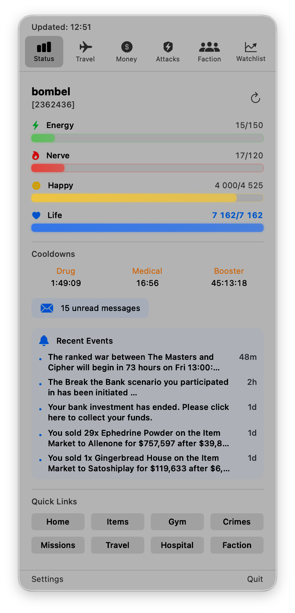
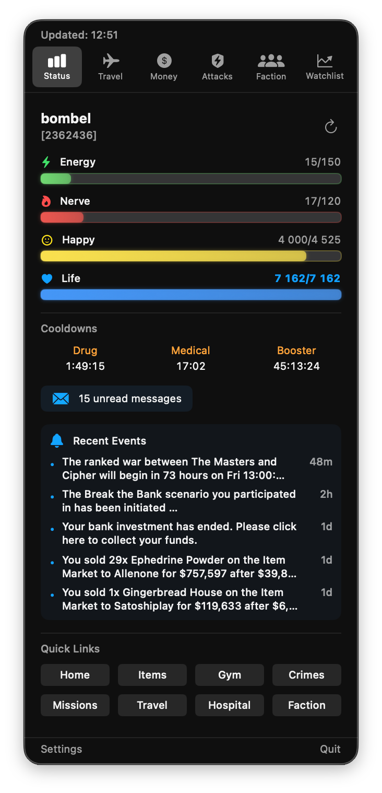

# MacTorn

Native, privacy-conscious macOS menu bar companion for [Torn](https://www.torn.com/).
See live account state, upcoming timers, travel, faction activity, market prices, and
forum updates without keeping the game open.

[](https://github.com/pawelorzech/MacTorn/actions/workflows/tests.yml)
[](https://github.com/pawelorzech/MacTorn/releases/latest)


[](LICENSE)

<p align="center">
  
  &nbsp;&nbsp;
  
</p>

## Highlights

- **Always-visible state:** the menu bar shows travel, hospital, jail, or the next
  cooldown as a live countdown.
- **Nine focused modules:** Status, Travel, Attacks, Money, Properties, Stocks,
  Faction, Watchlist, and Forums are grouped into a compact 320 pt popover.
- **Actionable notifications:** bar thresholds, cooldowns, landing, release, chain
  expiry, Organized Crime readiness, bounties, item prices, forum posts, and updates.
- **Budget-aware polling:** fast point-in-time data stays separate from throttled,
  row-based feeds, with live request and row budgets in Diagnostics.
- **Read-only by design:** MacTorn displays Torn data and opens Torn pages; it never
  performs game actions through the API.
- **Local-first security:** the API key lives in macOS Keychain, the app is sandboxed,
  logs and diagnostics are redacted, and crash reporting is opt-in.

## Features

### Now

- **Status:** Energy, Nerve, Happy, and Life; cooldowns; Next Action timeline;
  daily refills; education; hospital/jail state; bounties; unread messages; events;
  chain status; and eight Torn quick links.
- **Travel:** live flight and arrival countdowns, all 11 destinations, current
  standard and Private Island airstrip estimates, pre-arrival alerts, and travel links.
- **Attacks:** battle stats, total battle stat score, and recent attack outcomes with
  direct links to relevant Torn pages.

### Account

- **Money:** cash, vault, Cayman, points, tokens, tracked total, and common money actions.
- **Properties:** market value, cost, happy, ownership/rental state, and rental expiry.
- **Stocks:** scrollable holdings with names, acronyms, market value, and cost basis.
- **Faction:** faction and chain state, the player's Organized Crime 2.0 status,
  active ranked war progress, recent faction news, and armory shortcuts.

### Watch

- **Watchlist:** Torn API v2 item-market prices, quantity at the lowest price,
  price changes, threshold alerts, inline validation, and undo for destructive changes.
- **Forums:** thread or faction-forum watching by URL/ID, per-thread notification
  control, new-post alerts, and 2/3/5-minute polling options.

### Quality of life

- Automatic update checks against GitHub Releases.
- Launch at Login, preferred-browser selection, light/dark/system appearance, and
  configurable main polling (15/30/60/120 seconds).
- Explicit loading, stale-data, empty, permission, error, and retry states that keep
  the last good snapshot visible when an optional endpoint fails.
- Account-scoped state: changing the API key cancels in-flight work and clears data,
  alerts, and pending state from the previous account.

## Installation

1. Download the DMG from the [latest release](https://github.com/pawelorzech/MacTorn/releases/latest).
2. Open it and drag **MacTorn.app** to **Applications**.
3. Right-click MacTorn and choose **Open** on first launch.
4. Enter a [Torn API key](https://www.torn.com/preferences.php#tab=api), then use
   **Test Connection** to confirm its access.

### Requirements

- macOS 14 Sonoma or later.
- Intel (`x86_64`) or Apple Silicon (`arm64`) Mac.
- A **Limited Access** (or higher) Torn API key for every module. A Custom key can be
  used, and Test Connection reports which features its selections unlock.

### Why macOS shows a warning

Public builds are universal and ad-hoc signed, but they are not notarized with a paid
Apple Developer ID. Gatekeeper therefore cannot identify the publisher. Right-clicking
the app and choosing **Open** is the expected first-launch flow for this distribution
model.

### Verify the download

When the release notes include a SHA-256 checksum, compare it with the downloaded DMG:

```bash
shasum -a 256 ~/Downloads/MacTorn.dmg
```

The value must exactly match the checksum in the release notes. This detects a changed
or corrupted artifact; it does not replace Apple notarization.

## Privacy and security

- The Torn API key is stored as a generic password in macOS Keychain and is migrated
  away from legacy plaintext preferences automatically.
- Torn account snapshots remain in memory; persisted preferences contain configuration,
  watch items, and notification state rather than account stats or money.
- The App Sandbox grants only outbound network access, and Hardened Runtime is enabled.
- Request URLs, logs, notifications, and copied diagnostics are sanitized to avoid
  exposing keys or Torn PII.
- Sentry crash reporting is **off by default**. If enabled, performance tracing,
  session replay, default PII, network breadcrumbs, and failed-request capture remain
  disabled; URLs are redacted before an event can be sent.
- Update checks contact GitHub Releases, but do not include Torn account data.

See [SECURITY.md](SECURITY.md) for the supported-version policy, threat model summary,
and private vulnerability-reporting channel.

## Accessibility and keyboard control

MacTorn follows system Reduce Transparency, Reduce Motion, Increase Contrast, and
light/dark appearance settings. Its status surfaces expose semantic VoiceOver labels,
including live menu bar state, progress values, financial rows, attacks, events, chain,
and status badges. Long modules remain scrollable in the fixed-size popover.

Keyboard commands are available from the app's **Commands** menu:

| Shortcut | Action |
| --- | --- |
| `⌘R` | Refresh |
| `⌘,` | Settings |
| `⌘1` … `⌘9` | Status, Travel, Attacks, Money, Properties, Stocks, Faction, Watchlist, Forums |
| `Esc` | Leave Settings / return to the current module |

Automated accessibility and compact-window regressions run in CI. Manual validation
with every macOS assistive setting remains an ongoing release-quality activity; see
[IMPLEMENTATION_BACKLOG.md](IMPLEMENTATION_BACKLOG.md) for the explicit test matrix.

## API Data Usage

MacTorn's typed endpoint registry in
[`MacTorn/Networking/TornEndpoint.swift`](MacTorn/MacTorn/Networking/TornEndpoint.swift)
is the source of truth for request construction, onboarding disclosure, Diagnostics,
and the table below.

**Point-in-time** data (bars, money, cooldowns) can be polled frequently. **Row-based**
data (events, attacks, news, forum posts) counts against Torn's per-category daily row
limit, so MacTorn throttles and hard-limits those calls. A daily row-limit error pauses
only the affected feed; core live data continues updating.

| Endpoint | API | Selections | Data | Cadence | Rows/call | Budget | Critical | Purpose |
| --- | --- | --- | --- | --- | --- | --- | --- | --- |
| User (fast poll) | v1 | basic, bars, cooldowns, travel, profile, money, battlestats, properties, stocks | point-in-time | Every refresh interval (default 30s; 15s aggressive) | — | core | yes | Live Energy/Nerve/Happy/Life bars, drug/medical/booster cooldowns, travel status, money & net worth, battle stats, properties and stock holdings. |
| User v2 (combined) | v2 | organizedcrime, refills, education, bounties | point-in-time | Every refresh interval (rides the fast poll) | — | core | no | Own Organized Crime 2.0 status, daily refills remaining, in-progress education timer, and bounties placed on you. |
| User activity | v1 | events, messages, attacks | row-based | ≥5 min (self-throttled; hard row limit) | 25 | activity | no | Events feed, unread message count and recent attacks (display-only). |
| Faction basic + chain | v1 | basic, chain | point-in-time | Every refresh interval (rides the fast poll) | — | faction | no | Faction identity and the live chain counter/timeout that drives the chain-expiring alert. |
| Faction ranked wars | v2 | — | point-in-time | ≥5 min (throttled — large, slow-changing payload) | — | faction | no | Active ranked war progress (your faction vs. the opponent). |
| Faction news | v2 | — | row-based | ≥5 min (throttled; hard row limit) | 25 | faction | no | Recent faction news feed. |
| Item market | v2 | itemmarket, bazaar | point-in-time | Watchlist refresh (manual + on price-alert timer) | — | market | no | Lowest item-market listings for each watchlist item, used to drive price alerts. |
| Stock metadata | v1 | stocks | point-in-time | Rarely (cached; refreshed on demand) | — | metadata | no | Global stock names/acronyms used to label the user's stock holdings (slow-changing reference data). |
| Forum thread | v2 | — | row-based | Forum poll (opt-in feature) | 20 | forum | no | Post count of a watched forum thread, to alert on new replies. |
| Forum category threads | v2 | — | row-based | Forum poll (opt-in feature) | 20 | forum | no | Thread list of a watched forum category, to alert on new threads. |
| Key info | v2 | — | point-in-time | On demand (Test Connection / key change) | — | core | no | One-off validation of the API key: its access level/type, the owner's ID, and which selections it can read — used by onboarding's Test Connection. Never polled. |

All of these requests are read-only. MacTorn does not use the Torn API to submit game
actions.

## Development

The project is a native SwiftUI `MenuBarExtra` app targeting macOS 14. CI builds with
Xcode 16.4, which is the reference toolchain for reproducible local results.

```bash
git clone https://github.com/pawelorzech/MacTorn.git
cd MacTorn
make build
```

Open the project in Xcode with `make open`, or directly open
`MacTorn/MacTorn.xcodeproj`.

### Common commands

| Command | Purpose |
| --- | --- |
| `make test` | Unit tests |
| `make test-ui` | Hermetic fixture-driven UI tests |
| `make test-all` | Unit and UI tests |
| `make coverage-gate` | Unit coverage plus the 80% critical-module gate |
| `make analyze` | Xcode static analysis |
| `make build` | Debug build |
| `make release` | Universal, strict ad-hoc Release build for local use |
| `make verify-release` | Verify `arm64`/`x86_64` slices and ad-hoc signature |
| `make scan` | Scan Git history for secrets with gitleaks |

Code signing is disabled for normal local builds and tests. `make release` deliberately
uses strict ad-hoc signing; `make release-signed DEVELOPER_ID="…"` is available for a
Developer ID workflow.

### Architecture

```text
MacTornApp / ContentView
└── AppState (@MainActor facade)
    ├── AccountSessionStore       Keychain-backed account boundary
    ├── UserSnapshotService       Core user snapshots and validation
    ├── FactionService            Faction, chain, wars, and news
    ├── MarketWatchService        Item prices and price alerts
    ├── ForumWatchService         Watched threads and update detection
    ├── PollingCoordinator        Request and row budgets
    └── NotificationCoordinator   Persistent notification deduplication
```

Networking is injected through the `NetworkSession` protocol. Unit tests use routed
fixtures and isolated preferences; the DEBUG-only UI harness uses an in-memory Keychain,
fake networking, and controllable connectivity, so CI never reads a developer's real
Torn account.

CI runs unit tests and coverage, fixture UI tests, static analysis, and a verified
universal ad-hoc Release build. Swift Package Manager currently resolves Sentry Cocoa as
the only third-party runtime dependency.

## Documentation and support

- [Changelog](CHANGELOG.md)
- [Security policy](SECURITY.md)
- [Implementation status and remaining QA matrix](IMPLEMENTATION_BACKLOG.md)
- [Project wiki](https://github.com/pawelorzech/MacTorn/wiki)
- [Torn community thread](https://www.torn.com/forums.php#/p=threads&f=67&t=16532308)

If MacTorn is useful to you, you can support **bombel**
[[2362436](https://www.torn.com/profiles.php?XID=2362436)] in Torn.

## License

MacTorn is available under the [MIT License](LICENSE).

---

Made with ⚡ for the Torn community.
